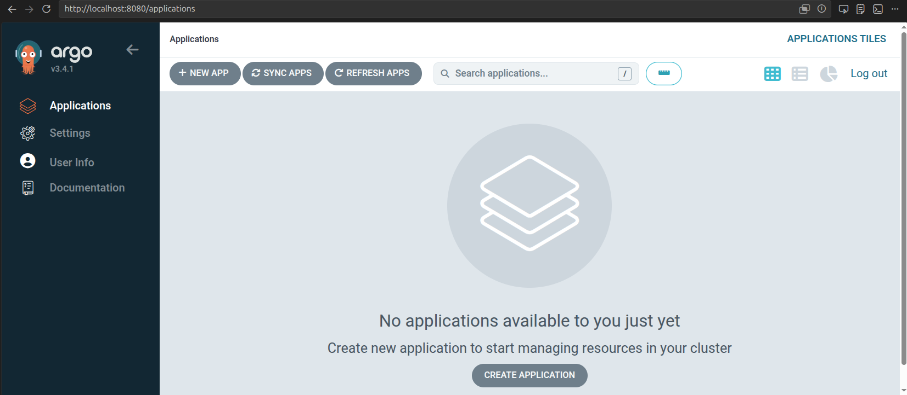
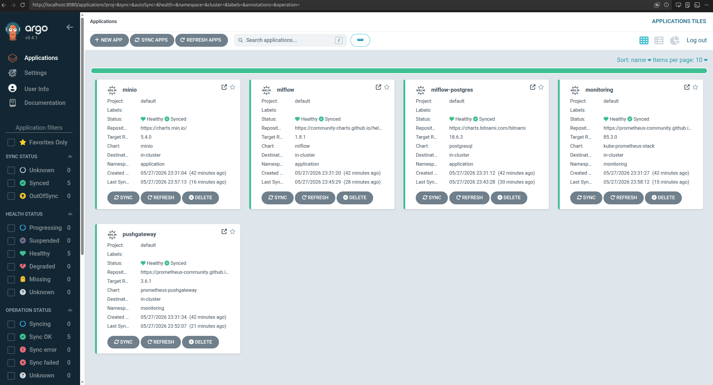
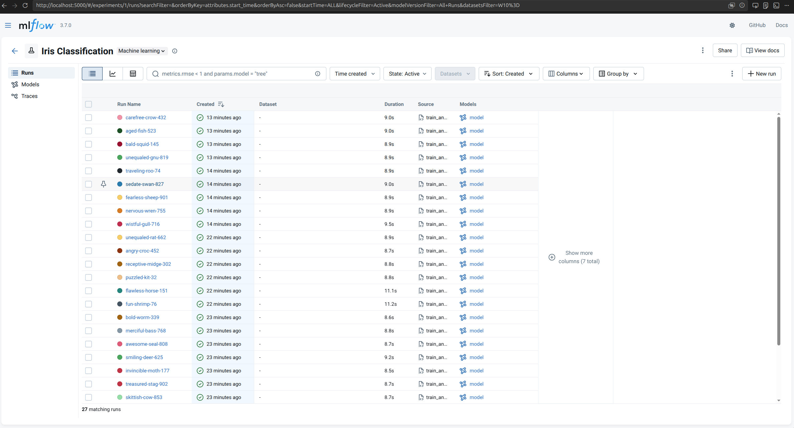
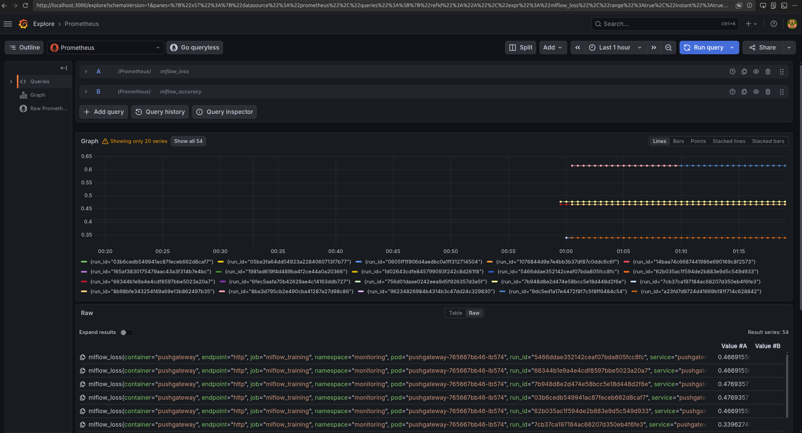
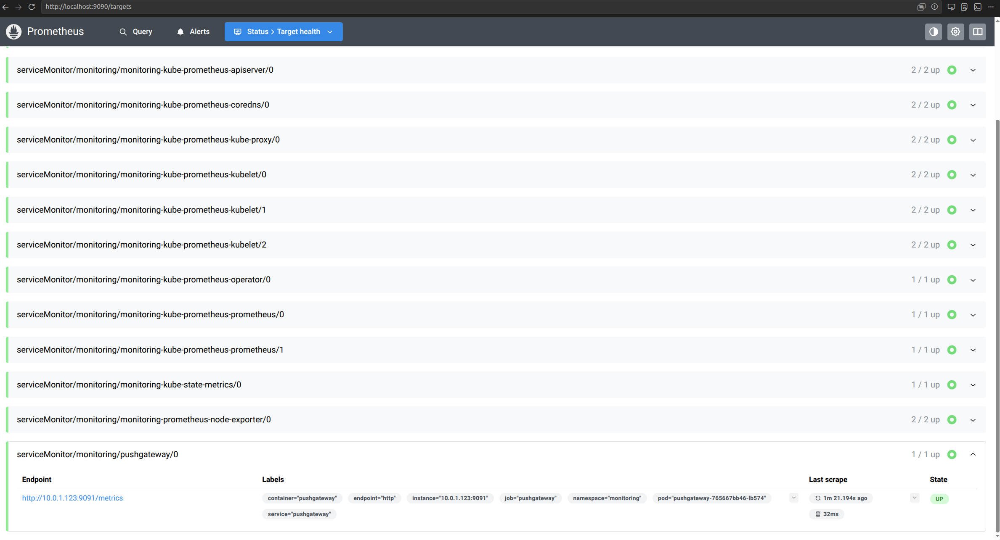

# [Lesson 8-9 — MLOps Stack на Kubernetes через ArgoCD](https://www.edu.goit.global/learn/25315460/38664777/38699504/homework)

Розгортання повноцінного MLOps-стеку на Kubernetes за допомогою ArgoCD (GitOps). Стек включає MLflow Tracking Server з PostgreSQL бекендом, MinIO для зберігання артефактів, Prometheus PushGateway для отримання метрик із скриптів та kube-prometheus-stack (Prometheus + Grafana) для їх візуалізації. Python-скрипт виконує серію ML-експериментів, логує результати в MLflow та надсилає метрики до Prometheus через PushGateway.

## Конфігурація за замовчуванням

| Параметр | Значення |
| --- | --- |
| AWS Region | `us-east-1` |
| AWS Profile | `devops` |
| EKS Cluster | `goit-eks-cluster` |
| Kubernetes Version | `1.33` |
| ArgoCD Chart | `argo-cd 9.5.13` |
| ArgoCD Namespace | `infra-tools` |
| MLflow Namespace | `application` |
| Monitoring Namespace | `monitoring` |
| MLflow Port | `5000` |
| PushGateway Port | `9091` |
| Grafana Port | `3000` |

## Структура проєкту

```text
goit-devops-lesson-8-9/
├── terraform/
│   ├── main.tf               # Кореневий модуль — викликає vpc, eks, argocd
│   ├── variables.tf
│   ├── outputs.tf
│   ├── terraform.tf          # required_providers + provider aws
│   ├── backend.tf            # local backend
│   ├── terraform.tfstate     # стан інфраструктури (локальний бекенд)
│   ├── vpc/                  # Модуль VPC (terraform-aws-modules/vpc/aws ~> 5.0)
│   │   ├── main.tf
│   │   ├── variables.tf
│   │   ├── outputs.tf
│   │   ├── terraform.tf
│   │   └── backend.tf
│   ├── eks/                  # Модуль EKS (terraform-aws-modules/eks/aws ~> 20.0)
│   │   ├── main.tf           # cpu-nodes (t3.small, desired=2) + gpu-nodes (desired=0, scaled down)
│   │   ├── variables.tf
│   │   ├── outputs.tf
│   │   ├── terraform.tf
│   │   └── backend.tf
│   └── argocd/               # Модуль ArgoCD (Helm chart argo-cd 9.5.13)
│       ├── main.tf
│       ├── variables.tf
│       ├── outputs.tf
│       ├── terraform.tf
│       ├── provider.tf
│       ├── backend.tf
│       └── values/
│           └── argocd-values.yaml
├── argocd/
│   └── applications/
│       ├── minio.yaml            # ArgoCD Application — MinIO (S3 artifact store, bucket mlflow-artifacts)
│       ├── postgres.yaml         # ArgoCD Application — PostgreSQL (MLflow backend DB)
│       ├── mlflow.yaml           # ArgoCD Application — MLflow Tracking Server (port 5000)
│       ├── pushgateway.yaml      # ArgoCD Application — Prometheus PushGateway (port 9091)
│       └── monitoring.yaml       # ArgoCD Application — kube-prometheus-stack (Prometheus + Grafana)
├── experiments/
│   ├── train_and_push.py         # ML-скрипт: навчання SGDClassifier, логування в MLflow, push метрик
│   └── requirements.txt
├── best_model/
│   ├── model.joblib              # Найкраща модель (з'являється після запуску скрипта)
│   └── run_info.txt              # run_id, accuracy, loss найкращого run
├── img/
│   ├── argocd-server.png
│   ├── argocd-server-apps.png
│   ├── mlflow-ui.png
│   ├── grafana-explore.png
│   └── prometheus-targets.png
└── README.md
```

## Передумови

| Інструмент | Версія | Примітка |
| --- | --- | --- |
| Terraform | >= 1.3 | для підняття VPC/EKS/ArgoCD |
| AWS CLI | >= 2 | профіль `devops` з необхідними правами |
| kubectl | >= 1.28 | |
| Python | >= 3.10 | для локального запуску скрипта |

## Розгортання (VPC + EKS + ArgoCD)

```bash
cd terraform

terraform init
terraform apply
```

### Перевірити kubectl

```bash
aws eks --region us-east-1 update-kubeconfig --name goit-eks-cluster --profile devops
kubectl get nodes
```

Приклад реального результату:

```text
NAME                         STATUS   ROLES    AGE   VERSION
ip-10-0-1-70.ec2.internal    Ready    <none>   12m   v1.33.11-eks-3385e9b
ip-10-0-2-166.ec2.internal   Ready    <none>   12m   v1.33.11-eks-3385e9b
```

### Перевірити ArgoCD

```bash
kubectl get pods -n infra-tools
kubectl get svc -n infra-tools
```

Приклад реального результату:

```text
❯ kubectl get pods -n infra-tools
NAME                                                READY   STATUS    RESTARTS   AGE
argocd-application-controller-0                     1/1     Running   0          3m32s
argocd-applicationset-controller-78bcd8564f-n8l5f   1/1     Running   0          3m34s
argocd-dex-server-7ccb4b765b-89txg                  1/1     Running   0          3m34s
argocd-redis-d6bcfc99c-pnmgx                        1/1     Running   0          3m34s
argocd-repo-server-5d8d78598-zqgk5                  1/1     Running   0          3m33s
argocd-server-69dbb986f6-sl5qb                      1/1     Running   0          3m33s

❯ kubectl get svc -n infra-tools
NAME                               TYPE        CLUSTER-IP       EXTERNAL-IP   PORT(S)             AGE
argocd-applicationset-controller   ClusterIP   172.20.24.213    <none>        7000/TCP            3m53s
argocd-dex-server                  ClusterIP   172.20.237.207   <none>        5556/TCP,5557/TCP   3m53s
argocd-redis                       ClusterIP   172.20.194.63    <none>        6379/TCP            3m53s
argocd-repo-server                 ClusterIP   172.20.140.172   <none>        8081/TCP            3m53s
argocd-server                      ClusterIP   172.20.121.227   <none>        80/TCP,443/TCP      3m53s
```


Отримати початковий пароль `admin`:

```bash
kubectl -n infra-tools get secret argocd-initial-admin-secret \
  -o jsonpath='{.data.password}' | base64 -d
```

Відкрити ArgoCD UI локально:

```bash
kubectl -n infra-tools port-forward svc/argocd-server 8080:80
# UI доступний на http://localhost:8080
```


## Розгортання MLOps-стек через ArgoCD

> Виконується з кореневої директорії проєкту (поза `terraform/`).

```bash
kubectl apply --validate=false -f argocd/applications/minio.yaml
kubectl apply --validate=false -f argocd/applications/postgres.yaml
kubectl apply --validate=false -f argocd/applications/mlflow.yaml
kubectl apply --validate=false -f argocd/applications/monitoring.yaml
kubectl apply --validate=false -f argocd/applications/pushgateway.yaml
```


> `--validate=false` потрібен, бо ArgoCD CRD `Application` не відомий kubectl без окремого schema.

ArgoCD автоматично синхронізує та розгортає всі компоненти. MLflow може тимчасово перебувати у `CrashLoopBackOff`, поки PostgreSQL і MinIO не стануть готовими, ArgoCD self-heal поверне його в `Healthy` за кілька хвилин.

### Перевірка стану

```bash
# ArgoCD Applications
kubectl get applications -n infra-tools

# Namespace application (MLflow, MinIO, PostgreSQL)
kubectl get pods -n application
kubectl get svc -n application

# Namespace monitoring (Prometheus, Grafana, PushGateway)
kubectl get pods -n monitoring
kubectl get svc -n monitoring
```

Приклад реального результату:

```text
NAME              SYNC STATUS   HEALTH STATUS
minio             Synced        Healthy
mlflow            Synced        Healthy
mlflow-postgres   Synced        Healthy
monitoring        Synced        Healthy
pushgateway       Synced        Healthy
```

## Port-forward

Відкрити окремі термінали для кожного сервісу:

```bash
# Термінал 1 — MLflow Tracking Server
kubectl -n application port-forward svc/mlflow 5000:5000

# Термінал 2 — Prometheus PushGateway
kubectl -n monitoring port-forward svc/pushgateway 9091:9091

# Термінал 3 — Grafana
kubectl -n monitoring port-forward svc/monitoring-grafana 3000:80

# Термінал 4 — Prometheus (опційно)
kubectl -n monitoring port-forward svc/monitoring-kube-prometheus-prometheus 9090:9090
```

## Локальне Python-середовище

```bash
python3 -m venv .venv
source .venv/bin/activate
pip install -r experiments/requirements.txt
```

## Запустити train_and_push.py

> **Важливо:** Перед запуском мають бути активні port-forward (MLflow :5000 та PushGateway :9091). Локальний доступ до MinIO не потрібен — MLflow використовує `proxiedArtifactStorage: true` і сам проксює артефакти.

```bash
MLFLOW_TRACKING_URI=http://localhost:5000 \
PUSHGATEWAY_URL=http://localhost:9091 \
python experiments/train_and_push.py
```

Скрипт запустить **9 runs** (3 learning_rate × 3 epochs), для кожного:

- Логує параметри та метрики в MLflow
- Зберігає модель як артефакт у MinIO через MLflow
- Пушить `mlflow_accuracy` та `mlflow_loss` у PushGateway з міткою `run_id`

Після завершення у [best_model/](./best_model/) з'являться `model.joblib` та `run_info.txt`.

Приклад реального результату:

```text
Starting 9 experiments — Iris Classification
--------------------------------------------------------------------------------
/home/nickolasz/Projects/GoIT/devops/goit-devops-lesson-8-9/.venv/lib/python3.12/site-packages/sklearn/linear_model/_stochastic_gradient.py:733: ConvergenceWarning: Maximum number of iteration reached before convergence. Consider increasing max_iter to improve the fit.
  warnings.warn(
2026/05/28 01:08:30 WARNING mlflow.models.model: `artifact_path` is deprecated. Please use `name` instead.
2026/05/28 01:08:32 WARNING mlflow.sklearn: Saving scikit-learn models in the pickle or cloudpickle format requires exercising caution because these formats rely on Python's object serialization mechanism, which can execute arbitrary code during deserialization. The recommended safe alternative is the 'skops' format. For more information, see: https://scikit-learn.org/stable/model_persistence.html
Run  1 | lr=0.001 | epochs=100 | accuracy=0.8333 | loss=0.4769 | run_id=db200c668640435c8245decd82d4aaae
🏃 View run wistful-gull-716 at: http://localhost:5000/#/experiments/1/runs/db200c668640435c8245decd82d4aaae
🧪 View experiment at: http://localhost:5000/#/experiments/1
2026/05/28 01:08:40 WARNING mlflow.models.model: `artifact_path` is deprecated. Please use `name` instead.
2026/05/28 01:08:42 WARNING mlflow.sklearn: Saving scikit-learn models in the pickle or cloudpickle format requires exercising caution because these formats rely on Python's object serialization mechanism, which can execute arbitrary code during deserialization. The recommended safe alternative is the 'skops' format. For more information, see: https://scikit-learn.org/stable/model_persistence.html
Run  2 | lr=0.001 | epochs=200 | accuracy=0.8333 | loss=0.4669 | run_id=05ba3fa64dd04923a2284060713f7b77
🏃 View run nervous-wren-755 at: http://localhost:5000/#/experiments/1/runs/05ba3fa64dd04923a2284060713f7b77
🧪 View experiment at: http://localhost:5000/#/experiments/1
2026/05/28 01:08:50 WARNING mlflow.models.model: `artifact_path` is deprecated. Please use `name` instead.
2026/05/28 01:08:52 WARNING mlflow.sklearn: Saving scikit-learn models in the pickle or cloudpickle format requires exercising caution because these formats rely on Python's object serialization mechanism, which can execute arbitrary code during deserialization. The recommended safe alternative is the 'skops' format. For more information, see: https://scikit-learn.org/stable/model_persistence.html
Run  3 | lr=0.001 | epochs=500 | accuracy=0.8333 | loss=0.4669 | run_id=1076844d9e7e4bb3b37df87c0ddc6c6f
🏃 View run fearless-sheep-901 at: http://localhost:5000/#/experiments/1/runs/1076844d9e7e4bb3b37df87c0ddc6c6f
🧪 View experiment at: http://localhost:5000/#/experiments/1
2026/05/28 01:08:59 WARNING mlflow.models.model: `artifact_path` is deprecated. Please use `name` instead.
2026/05/28 01:09:02 WARNING mlflow.sklearn: Saving scikit-learn models in the pickle or cloudpickle format requires exercising caution because these formats rely on Python's object serialization mechanism, which can execute arbitrary code during deserialization. The recommended safe alternative is the 'skops' format. For more information, see: https://scikit-learn.org/stable/model_persistence.html
Run  4 | lr=0.010 | epochs=100 | accuracy=0.9000 | loss=0.3396 | run_id=96234826984b4314b3c47dd24c329830
🏃 View run sedate-swan-827 at: http://localhost:5000/#/experiments/1/runs/96234826984b4314b3c47dd24c329830
🧪 View experiment at: http://localhost:5000/#/experiments/1
2026/05/28 01:09:09 WARNING mlflow.models.model: `artifact_path` is deprecated. Please use `name` instead.
2026/05/28 01:09:11 WARNING mlflow.sklearn: Saving scikit-learn models in the pickle or cloudpickle format requires exercising caution because these formats rely on Python's object serialization mechanism, which can execute arbitrary code during deserialization. The recommended safe alternative is the 'skops' format. For more information, see: https://scikit-learn.org/stable/model_persistence.html
Run  5 | lr=0.010 | epochs=200 | accuracy=0.9000 | loss=0.3396 | run_id=1981ad619f4d489ba4f2ce44a0a20366
🏃 View run traveling-roo-74 at: http://localhost:5000/#/experiments/1/runs/1981ad619f4d489ba4f2ce44a0a20366
🧪 View experiment at: http://localhost:5000/#/experiments/1
2026/05/28 01:09:18 WARNING mlflow.models.model: `artifact_path` is deprecated. Please use `name` instead.
2026/05/28 01:09:21 WARNING mlflow.sklearn: Saving scikit-learn models in the pickle or cloudpickle format requires exercising caution because these formats rely on Python's object serialization mechanism, which can execute arbitrary code during deserialization. The recommended safe alternative is the 'skops' format. For more information, see: https://scikit-learn.org/stable/model_persistence.html
Run  6 | lr=0.010 | epochs=500 | accuracy=0.9000 | loss=0.3396 | run_id=fed21697c3f749d8969ec2a26c0b7885
🏃 View run unequaled-gnu-819 at: http://localhost:5000/#/experiments/1/runs/fed21697c3f749d8969ec2a26c0b7885
🧪 View experiment at: http://localhost:5000/#/experiments/1
2026/05/28 01:09:28 WARNING mlflow.models.model: `artifact_path` is deprecated. Please use `name` instead.
2026/05/28 01:09:31 WARNING mlflow.sklearn: Saving scikit-learn models in the pickle or cloudpickle format requires exercising caution because these formats rely on Python's object serialization mechanism, which can execute arbitrary code during deserialization. The recommended safe alternative is the 'skops' format. For more information, see: https://scikit-learn.org/stable/model_persistence.html
Run  7 | lr=0.100 | epochs=100 | accuracy=0.7667 | loss=0.6159 | run_id=756d01daae0242eea9d5f926357d3a5f
🏃 View run bald-squid-145 at: http://localhost:5000/#/experiments/1/runs/756d01daae0242eea9d5f926357d3a5f
🧪 View experiment at: http://localhost:5000/#/experiments/1
2026/05/28 01:09:38 WARNING mlflow.models.model: `artifact_path` is deprecated. Please use `name` instead.
2026/05/28 01:09:40 WARNING mlflow.sklearn: Saving scikit-learn models in the pickle or cloudpickle format requires exercising caution because these formats rely on Python's object serialization mechanism, which can execute arbitrary code during deserialization. The recommended safe alternative is the 'skops' format. For more information, see: https://scikit-learn.org/stable/model_persistence.html
Run  8 | lr=0.100 | epochs=200 | accuracy=0.7667 | loss=0.6159 | run_id=9dc5ed1a17e4472f8f7c5f8ff6484c54
🏃 View run aged-fish-523 at: http://localhost:5000/#/experiments/1/runs/9dc5ed1a17e4472f8f7c5f8ff6484c54
🧪 View experiment at: http://localhost:5000/#/experiments/1
2026/05/28 01:09:47 WARNING mlflow.models.model: `artifact_path` is deprecated. Please use `name` instead.
2026/05/28 01:09:50 WARNING mlflow.sklearn: Saving scikit-learn models in the pickle or cloudpickle format requires exercising caution because these formats rely on Python's object serialization mechanism, which can execute arbitrary code during deserialization. The recommended safe alternative is the 'skops' format. For more information, see: https://scikit-learn.org/stable/model_persistence.html
Run  9 | lr=0.100 | epochs=500 | accuracy=0.7667 | loss=0.6159 | run_id=bcbc6fd999c74883bf350c89609a9b51
🏃 View run carefree-crow-432 at: http://localhost:5000/#/experiments/1/runs/bcbc6fd999c74883bf350c89609a9b51
🧪 View experiment at: http://localhost:5000/#/experiments/1
--------------------------------------------------------------------------------

Best run: run_id=fed21697c3f749d8969ec2a26c0b7885 | accuracy=0.9000
       
Best model saved to best_model/model.joblib
  run_id   : fed21697c3f749d8969ec2a26c0b7885
  accuracy : 0.9000
  loss     : 0.3396
```

## Перевірити MLflow UI

MLflow UI доступний на [http://localhost:5000](http://localhost:5000) після активації port-forward.

Має відображатись experiment `Iris Classification` з 9 runs та метриками `accuracy` і `loss`.



## Перевірити метрики в Grafana

1. Відкрити Grafana: [http://localhost:3000](http://localhost:3000)
   - Логін: `admin`, пароль — отримати з секрету:

     ```bash
     kubectl get secret monitoring-grafana -n monitoring \
       -o jsonpath='{.data.admin-password}' | base64 -d
     ```

2. **Explore → Prometheus**
3. Виконати запити: `mlflow_accuracy` та `mlflow_loss`


Перевірити scrape target PushGateway у Prometheus: [http://localhost:9090](http://localhost:9090) → **Status → Targets** — рядок `pushgateway` повинен мати статус **UP**.


## Знищення інфраструктури

```bash
cd terraform
terraform destroy
```

Приклад виводу:

```text
Destroy complete! Resources: 66 destroyed.
```

> **Увага:** `terraform destroy` знищить VPC, EKS-кластер та всі розгорнуті сервіси, включно з ArgoCD, MLflow, MinIO, PostgreSQL, Prometheus та Grafana.

## Кастомізація

```bash
# Змінити AWS профіль
terraform apply -var="aws_profile=devops"

# Змінити розмір кластера
terraform apply -var="desired_size=2" -var="max_size=3"

# Змінити Kubernetes версію
terraform apply -var="kubernetes_version=1.33"
```